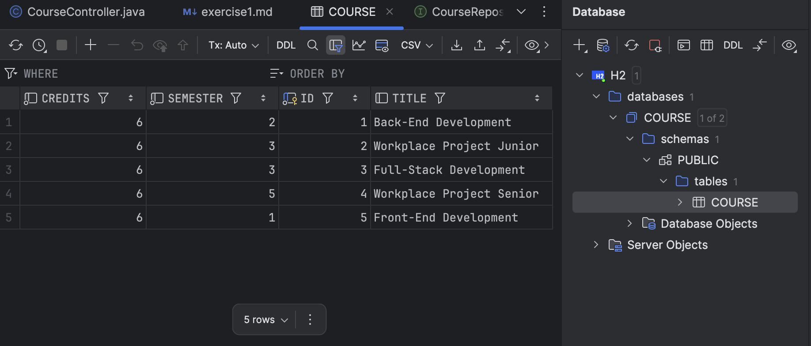

# Exercise 1

Make sure that the code uses an H2 database instead of a List for storing courses.

When starting the application, the following courses should be stored in the DB:
- Back-End Development, 6 credits, semester 2
- Workplace Project Junior, 6 credits, semester 3
- Full-Stack Development, 6 credits, semester 3
- Workplace Project Senior, 6 credits, semester 5
- Front-End Development, 6 credits, semester 1

Configure the Database client of IntelliJ, you should see the following result

